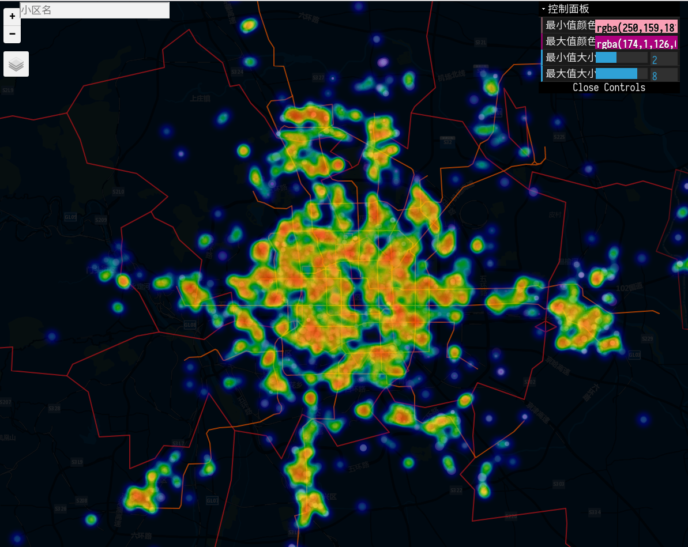
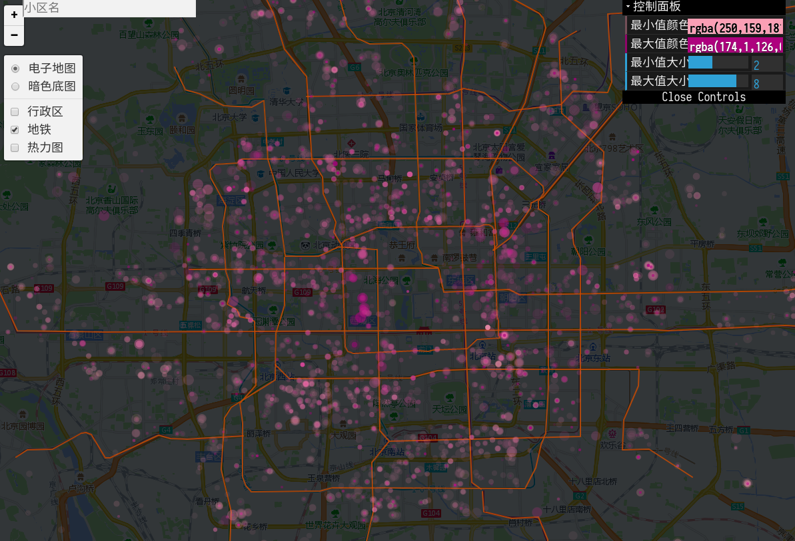
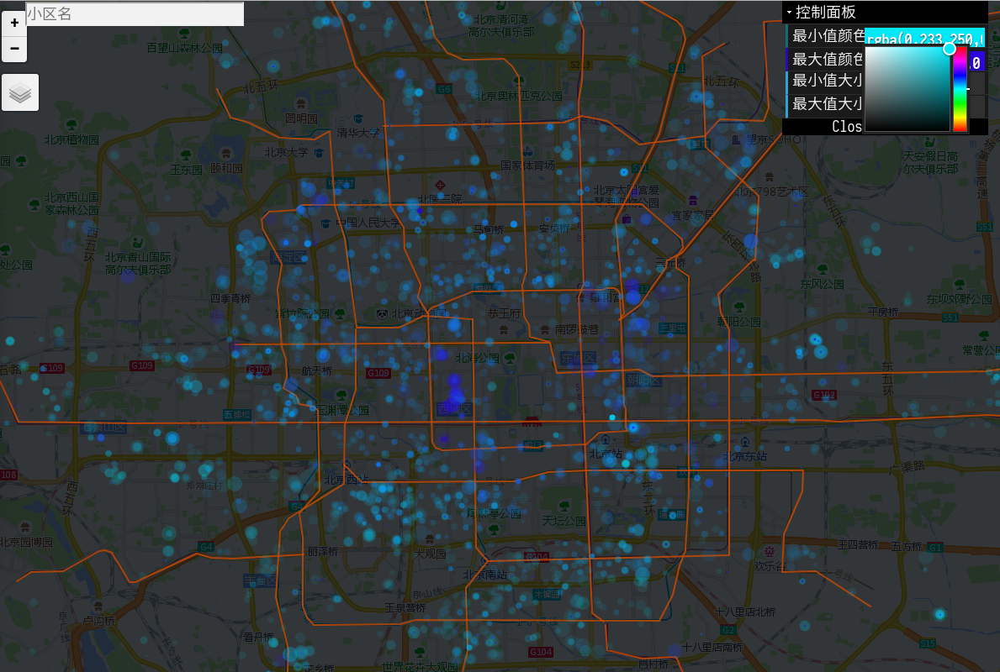
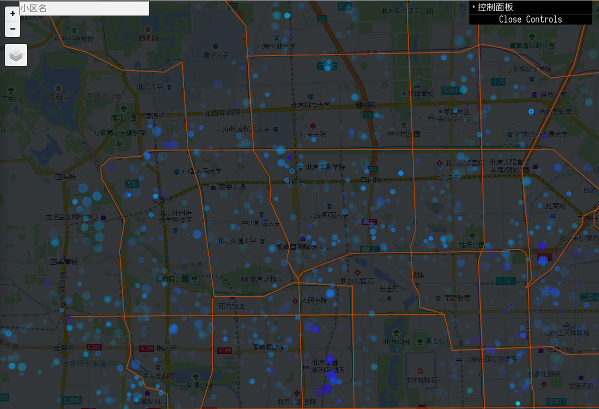
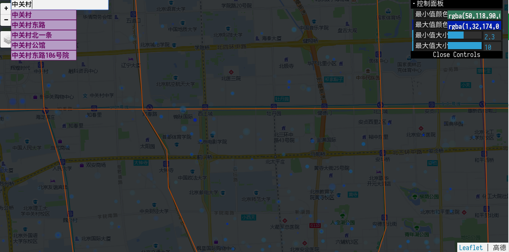
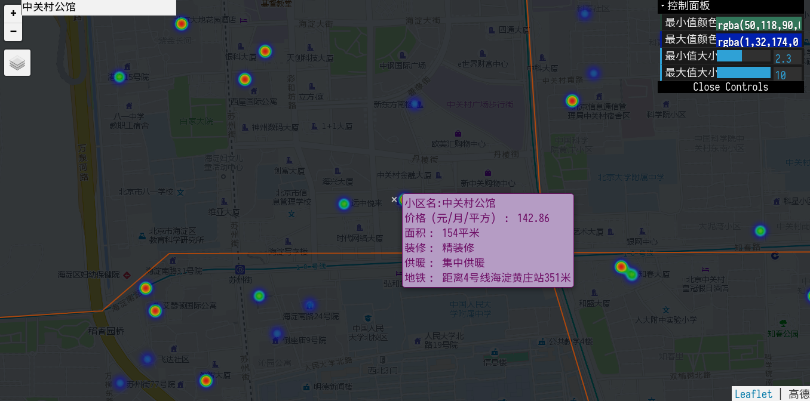
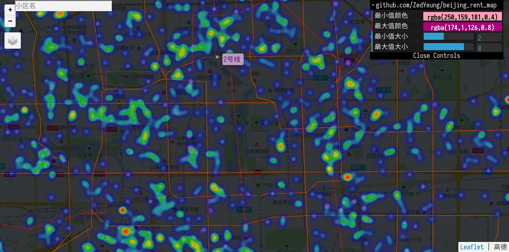

# [Beijing Rent Market Map](https://website-183523.appspot.com/)

# Toggle Layer
Toggle layer on top left layer button

Base layer:
 1. Gaode map
 2. Geoq dark map

Function layer:
 1. District boundary
 2. Subway line
 3. Heatmap

# Control Panel
Control color and circle size on top right control panel.

# Zoom and Drag
Zoon in and zoom out with top left button or mouse scroll.

Drag can be used but not immediately response.

git remote add origin git@github.com:ZedYeung/beijing_rent_map.git
# Search
Search with top left search bar.
The search engine will give clue with input.
And then the map will locate the searched item.

# Tooltip

Click the circle point, the tooltip will pop up with the information about name, unit price, decoration, the distance to subway, etc.

# Locate house near subway

Just click the subway line, the map will automatically locate it.

